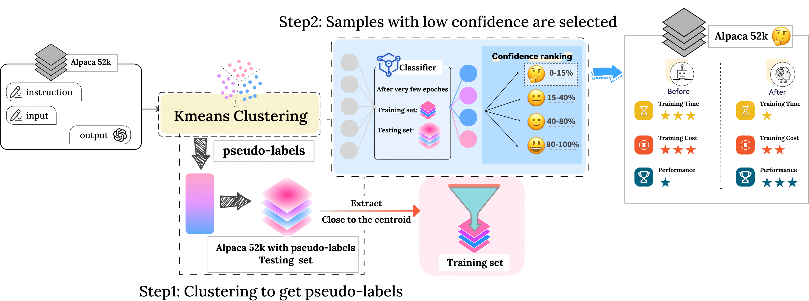

<h1 align="center">Low-Confidence Gold: Refining Low-Confidence Samples for Efficient Instruction Tuning</h1>
<!-- Clustering and Ranking: Diversity-preserved Instruction Selection through Expert-aligned Quality Estimation -->
<h4 align="center"> Hongyi cal, jie li, wenzhen Dong</h4>

<p align="center">
     <br>
    Our Model "AlpaCaR" is pronounced as "/ˈælpəˈkɑːr/". The logo is generated by <a href="https://chat.openai.com">DALL·E 3</a>.
</p>

## News💡
- [2025.01] We release our 📄<a href="https://arxiv.org/abs/2502.18978">paper</a>. If you have any questions about our project, please send email to xcloudfance@gmail.com

## Overview

### Low-Confidence Gold

The effectiveness of instruction fine-tuning for Large Language Models is fundamentally constrained by the quality and efficiency of training datasets.
This work introduces Low-Confidence Gold (LCG), a novel filtering framework that employs centroid-based clustering and confidence-guided selection for identifying valuable instruction pairs.
Through a semi-supervised approach using a lightweight classifier trained on representative samples, LCG curates high-quality subsets while preserving data diversity.
Experimental evaluation demonstrates that models fine-tuned on LCG-filtered subsets of 6K samples achieve superior performance compared to existing methods, with substantial improvements on MT-bench and consistent gains across comprehensive evaluation metrics.
The framework's efficacy while maintaining model performance establishes a promising direction for efficient instruction tuning.

## Approach

<p align="center" width="40%">
<a ></a>
</p>

## Usage 🛠


First, [install PyTorch 1.7.1](https://pytorch.org/get-started/locally/) (or later) and torchvision, as well as small additional dependencies, and then install this repo as a Python package. On a CUDA GPU machine, the following will do the trick:

```bash
$ conda install --yes -c pytorch pytorch=1.7.1 torchvision cudatoolkit=11.0
$ pip install git+https://github.com/Lizruletheworld/Low-Confidence_Gold.git
```

### Clustering

Default setting
```bash
python Clustering/cluster.py  --input='XX.json'
```
> 'XX.json' needs to be in the format of 'alpaca_data.json'.Then you can get the training set and the test set.


### Semi-supervised learning

We gave two models as semi-supervised model examples, one is DistilBERT and the other is MultinomialNB.
```bash
python DistilBERT/train.py  --input='XX.json'
```
> 'XX.json' needs to be in the format of training set.


